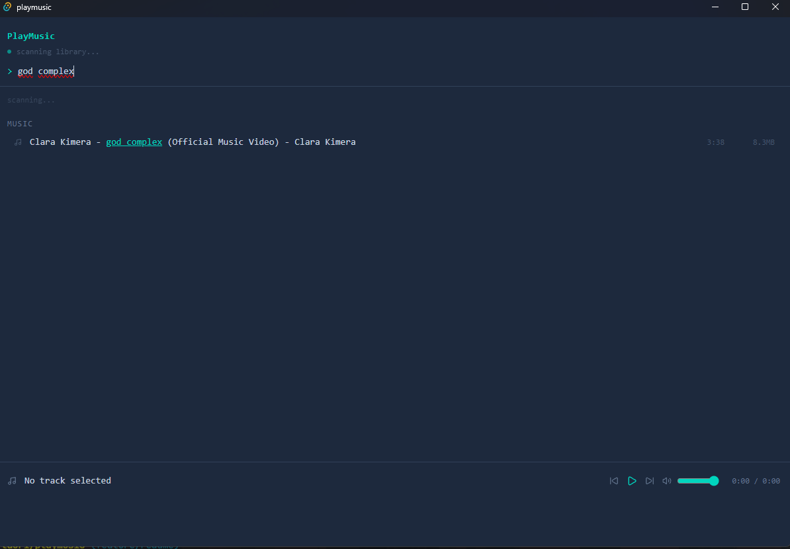
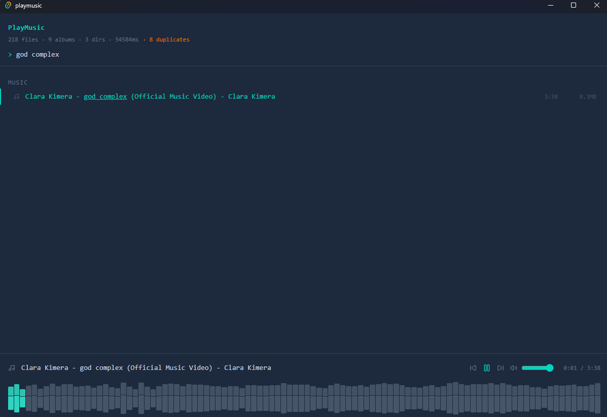
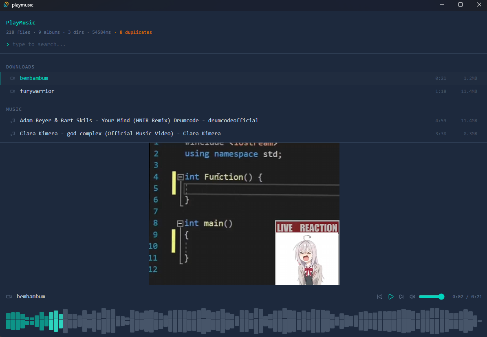

# PlayMusic

A cross-platform media player built with Tauri, React, and Rust. Scans your home directory for audio and video files, groups them by folder, and plays them with a keyboard-driven waveform UI inspired by terminal aesthetics.

## Screenshots

### Library view


### Waveform view


### Video playback


## Features

- Recursive scan of the home directory (up to 3 levels deep) on startup
- Automatic grouping by top-level directory → subfolder → file
- Incremental UI updates streamed from Rust via Tauri events as files are found
- Fuzzy search across filenames, albums, and directory names via `fuse.js`
- Duplicate detection via partial MD5 hashing of file start/end bytes
- Collapsible album sections with persisted state via `localStorage`
- Soundcloud-style mirrored waveform visualizer with click-to-seek
- Resizable player bar with drag handle that also hosts the video viewport
- Support for audio (mp3, flac, wav, aac, ogg) and video (mp4, mkv, webm, avi, mov)
- Native keyboard shortcuts (space, arrows) with scoped focus handling
- Track metadata (duration, file size) read via `lofty`
- Waveform generation server-side via `symphonia` to avoid WebView crashes on large files

## Supported Formats

| Format | Audio | Video | Waveform |
|---|---|---|---|
| mp3 | ✅ | | ✅ |
| flac | ✅ | | ✅ |
| wav | ✅ | | ✅ |
| aac | ✅ | | ✅ |
| ogg | ✅ | | ✅ |
| mp4 | | ✅ | ✅ (audio track) |
| mkv | | ✅ | partial |
| webm | | ✅ | partial |
| avi | | ✅ | partial |
| mov | | ✅ | partial |

## Roadmap

| # | Description | Type | Status |
|---|---|---|---|
| 1 | Fuzzy search via `fuse.js` | Feature | Done |
| 2 | Collapsible album sections | Feature | Done |
| 3 | Persistent collapsed state | Feature | Done |
| 4 | Incremental scan streaming | Feature | Done |
| 5 | Duplicate detection (partial hash) | Feature | Done |
| 6 | Waveform visualizer | Feature | Done |
| 7 | Video playback with resizable viewport | Feature | Done |
| 8 | Custom scan directories via settings UI | Feature | Planned |
| 9 | Parallel metadata reading with `rayon` | Perf | Planned |
| 10 | Autocomplete dropdown with keyboard nav | Feature | Planned |
| 11 | Playlist support | Feature | Planned |
| 12 | Shuffle / loop modes | Feature | Planned |
| 13 | Network streaming from custom API | Feature | Researching |
| 14 | Mobile builds (Tauri 2.0 iOS / Android) | Feature | Researching |
| 15 | Headphone removal auto-pause | Feature | Not possible without native platform APIs |

## Usage

Development:
```bash
bun install
bun run tauri dev
```
Production build:
```bash
bun run tauri build
```

Produces platform-native installers in `src-tauri/target/release/bundle/`.

## Hotkeys

- `space` — pause / resume
- `←` / `→` — seek 5 seconds
- `↑` / `↓` — adjust volume
- `enter` in search — (planned: play if one result)
- click waveform — seek to position
- click track — play immediately

## Requirements

- Bun 1.1+
- Rust (stable, managed via `rustup`)
- On Windows: Microsoft C++ Build Tools
- On macOS: Xcode Command Line Tools
- On Linux: `webkit2gtk-4.1`, `build-essential`, `libssl-dev`

## Architecture

### Rust (src-tauri)

- `scanner.rs` — `WalkDir`-based recursive scan, builds nested Directory/Album/MediaFile tree, emits `scan_progress` events every 10 files, returns `ScanResult` with metadata + duplicates
- `waveform.rs` — `symphonia` decoder reads the first 60 seconds of audio and downsamples to 100 normalized `f32` bars
- `lib.rs` — Tauri entry point, command registration

### React (src)

- `App.tsx` — top-level composition, listens to scan events, applies fuzzy filter via `useMemo`
- `components/Library.tsx` — renders filtered directory tree with collapsible albums
- `components/PlayerBar.tsx` — playback UI, resizable, hosts video element
- `hooks/useMediaPlayer.ts` — unified audio/video playback, volume, mute, seek, keyboard shortcuts
- `hooks/useWaveform.ts` — invokes Rust `generate_waveform` command
- `hooks/useResizable.ts` — generic drag-to-resize logic
- `hooks/useCollapsed.ts` — Set-based collapse state with localStorage persistence
- `hooks/usePlayer.ts` — flat track list navigation (next/prev)
- `utils/filterDirs.ts` — fuzzy search via weighted Fuse index

### IPC

- JS → Rust: `invoke('scan_media')`, `invoke('generate_waveform', { path })`
- Rust → JS: `emit('scan_progress', directories)` — batched every 10 files during scan

## Why Tauri over Electron

- ~10MB binary instead of 150MB+
- Rust backend for filesystem scanning and audio decoding — faster and more memory-safe than Node for heavy work
- Same webview-based frontend developer experience
- Native webview on each platform (WebView2, WKWebView, WebKitGTK)

## Why server-side waveform generation

The browser's `AudioContext.decodeAudioData` loads the full file into memory as raw PCM before any processing can begin. A 38-minute stereo track decodes to roughly 800MB of floats, which crashes the WebView process on large files.

Moving waveform generation to Rust with `symphonia` bounded memory usage to the decoded portion (first 60s) regardless of file size, while also producing cleaner output via native format parsers.

